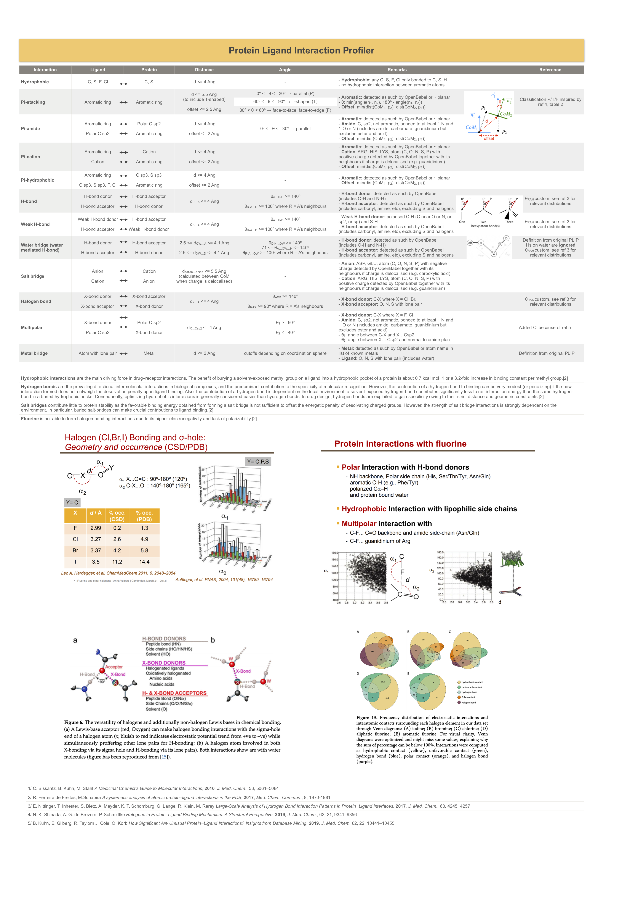

# PLIP - Protein-Ligand Interaction Profiler
In-house version of Salentin's code (https://github.com/ssalentin/plip)



Analyses interactions in 3 steps:
1. Detects atoms and groups with specific properties in the receptor and in the ligand

2. Detects interactions between receptor and ligand

3. Refines interactions to avoid double counts
  - Hydrophobic interactions:
      * Remove hydrophobic contacts for atoms that also interact via pi-hydrophobic,
      * Filter out contacts that involve an atom also involved in another hydrophobic interaction
  - Pi-Cation interactions:
      * If pi-cation and pi-stacking reported for the same L-P residues, keep the pi-stacking (e.g. histidine rings also positively charged)
  - Pi-Hydrophobic interactions:
      * Filter out contacts that involve an atom also involved in another pi-hydrophobic interaction
  - H-Bonds:
      * Remove contact if donor AND acceptor form a salt bridge
      * Remove contact if H-bond actually part of a water bridge
      * Remove contact if ligand atom part of a metal complex and H-bond with a binder of that same complex
      * Allow only one H-bond per donor
  - Water Bridges:
      * If water bridge with a water involved in a metal complex, keep the metal complex (water molecules coordinated to metals tend to form lots of water bridges and H-bonds just because they are close, but angles can be unrealistic)


## Installation

### Poetry

[After installing poetry](https://python-poetry.org/docs/#installation),
 you can install the environment:
```
poetry install
```

Don't forget to update the lock file if the dependencies have change:
```
poetry lock
```

### Pre-commit

[Pre-commit](https://pre-commit.com/) add a hook before your commit
and run flake8, black, mypy and other checks.

To install pre-commit:
```
brew install pre-commit
```

To set the hook on the repository
```bash
pre-commit install
```

## Environnement

Useful commands:
```
# Run tests
poetry run task test

# Indent your files with black
poetry run task black

# Check your code with mypy
poetry run task mypy

# Check style
poetry run task linter
```
